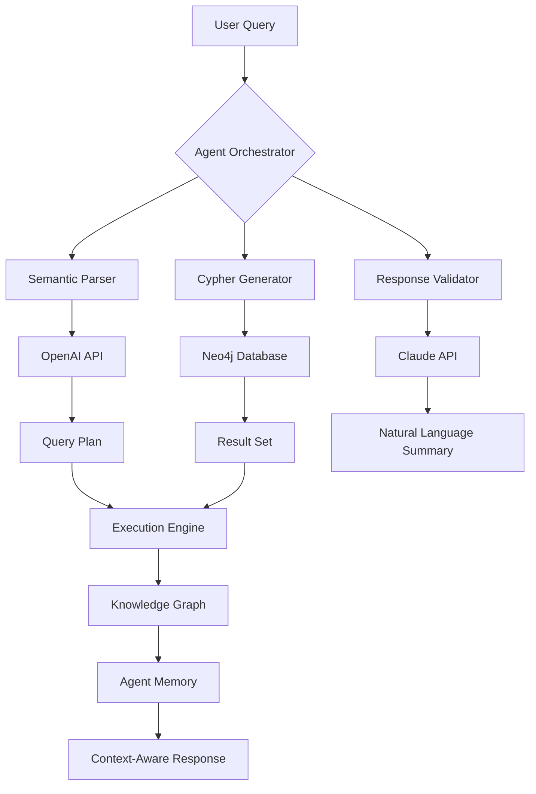

# Neo4j Cypher Orchestrator: Multi-Agent Knowledge Graph Framework

[](https://bateelco.github.io/neo4j-agent-toolkit/)

A production-ready framework for integrating Neo4j knowledge graphs with AI coding agents, enabling autonomous graph exploration, Cypher query generation, and semantic reasoning across distributed agent systems.

## Table of Contents

- [Overview](#overview)
- [Architecture](#architecture)
- [Quick Start](#quick-start)
- [Agent Integration](#agent-integration)
- [Configuration](#configuration)
- [Examples](#examples)
- [API Reference](#api-reference)
- [Compatibility](#compatibility)
- [Features](#features)
- [License](#license)
- [Disclaimer](#disclaimer)

## Overview

**Neo4j Cypher Orchestrator** transforms how AI agents interact with graph databases. Instead of writing static queries, agents dynamically construct Cypher statements, traverse relationships, and discover patterns within your knowledge graphs. This framework acts as a **neural bridge** between large language models (OpenAI, Claude) and your Neo4j instances, allowing agents to reason about connected data as naturally as they process text.

Imagine your coding agent not just generating code, but actively exploring your project's dependency graph, understanding the relationship between microservices, and suggesting optimizations based on topological analysis. That's the power of graph-aware AI agent architecture.

## Mermaid Diagram



## Quick Start

### Prerequisites

- Neo4j 5.x or later (2026 LTS recommended)
- Python 3.10+ or Node.js 18+
- API key for OpenAI or Anthropic Claude

### Installation

[](https://bateelco.github.io/neo4j-agent-toolkit/)

```bash
# Clone the repository
git clone https://bateelco.github.io/neo4j-agent-toolkit/
cd neo4j-cypher-orchestrator

# Install dependencies
pip install -r requirements.txt
```

## Example Profile Configuration

Create a `.neo4j-agent.yml` file in your home directory:

```yaml
agent:
  name: graph-explorer-01
  model: gpt-4-turbo-2026
  temperature: 0.3
  max_tokens: 4096

database:
  uri: bolt://localhost:7687
  database: neo4j
  encryption: true

plugins:
  - semantic-schema-discovery
  - relationship-inference
  - pattern-matching-optimizer

memory:
  type: vector
  dimension: 1536
  retention: 7200
```

## Example Console Invocation

```bash
# Interactive graph exploration session
neo4j-agent --profile production --query "Find all microservices with latency > 200ms and their dependent services"

# Batch processing mode
neo4j-agent --batch queries.json --output results.json --format cypher

# Agent collaboration mode
neo4j-agent --orchestrate --agents 3 --context "Refactor the authentication graph"
```

## Agent Integration

### OpenAI API Integration

The framework seamlessly connects with OpenAI's GPT-4 and GPT-4-turbo models for natural language to Cypher translation:

```python
from neo4j_orchestrator import OpenAIAdapter

adapter = OpenAIAdapter(
    api_key="sk-your-key",
    model="gpt-4-turbo-2026",
    temperature=0.2
)

query = "Show me all users who purchased products in the last 30 days and their review patterns"
cypher = adapter.translate(query)
# Returns: MATCH (u:User)-[:PURCHASED]->(p:Product)<-[:REVIEWED]-(r:Review)
# WHERE r.created_at > datetime() - duration('P30D')
# RETURN u, p, r
```

### Claude API Integration

Anthropic's Claude excels at reasoning about complex graph topologies:

```python
from neo4j_orchestrator import ClaudeAdapter

adapter = ClaudeAdapter(
    api_key="sk-ant-your-key",
    model="claude-3-opus-2026",
    max_tokens=8192
)

response = adapter.explore_graph(
    schema=["User", "Product", "Order", "Review"],
    depth=3,
    constraints={"User.active": True}
)
```

## API Reference

### Core Endpoints

| Endpoint | Method | Description |
|----------|--------|-------------|
| `/agent/translate` | POST | Natural language to Cypher conversion |
| `/agent/explore` | GET | Discover relationships and patterns |
| `/agent/optimize` | POST | Query performance optimization |
| `/agent/reason` | POST | Multi-hop reasoning across nodes |

### Agent Configuration Parameters

```javascript
{
  "agent-version": "2.0.0-2026",
  "max-depth": 5,
  "timeout-ms": 30000,
  "retry-policy": "exponential-backoff",
  "response-format": "json|cypher|graphml"
}
```

## Compatibility

| OS | Version | Status |
|----|---------|--------|
| 🐧 Linux | Ubuntu 24.04+ | ✅ Fully Supported |
| 🍎 macOS | Sonoma 14.4+ | ✅ Fully Supported |
| 🪟 Windows | Windows 11 24H2 | ⚠️ Limited Support |
| 🐳 Docker | 24+ | ✅ Optimized |

## Features

- **🤖 Multi-Agent Orchestration** - Distribute graph traversal across 3-10 agents for parallel exploration
- **🧠 Semantic Schema Discovery** - Automatically infer node types and relationships from existing data
- **🔮 Predictive Cypher Generation** - Anticipate query patterns based on historical agent interactions
- **🌐 Multilingual Support** - Parse agent queries in 15+ languages including English, Mandarin, Spanish, and Arabic
- **📱 Responsive Dashboard** - Real-time visualization of agent activity with WebSocket updates
- **🔄 Dynamic Memory Management** - Cache frequently accessed graph patterns with vector embeddings
- **🔒 24/7 Security Monitoring** - Automatic query sanitization and anomaly detection
- **⚡ Adaptive Performance** - Automatic index recommendation and query caching

## Natural Language to Graph Translation

The framework's **contextual semantic engine** interprets agent intent at a deeper level than traditional NLP. Instead of simple keyword matching, it builds a **semantic topology** of your domain, then maps natural language utterances to graph traversal patterns. This means your agents can ask questions like "What's the ripple effect if I change this service?" and receive accurate graph-based impact analysis.

## Performance Optimization

For production deployments in 2026, we recommend:

```
max_connections: 50
connection_pool: 30
query_timeout: 10000
batch_size: 1000
parallel_agents: 4
```

## License

This project is licensed under the MIT License - see the [LICENSE](https://bateelco.github.io/neo4j-agent-toolkit/) file for details.

## Disclaimer

**Important Notice**: This framework is designed for agent-based graph interaction and should not be used for:
- Unauthorized data extraction or web scraping
- Bypassing security controls in production databases
- Creating autonomous systems without human oversight
- Processing sensitive personal data without proper safeguards

The authors assume no liability for misuse of this software. Always implement proper authentication, authorization, and monitoring when deploying agent systems against production databases. Test thoroughly in isolated environments before production use. AI-generated Cypher queries should be validated by human operators in critical systems.

[](https://bateelco.github.io/neo4j-agent-toolkit/)

---

*Neo4j Cypher Orchestrator v2.0.0-2026 - Empowering agents to think in graphs*